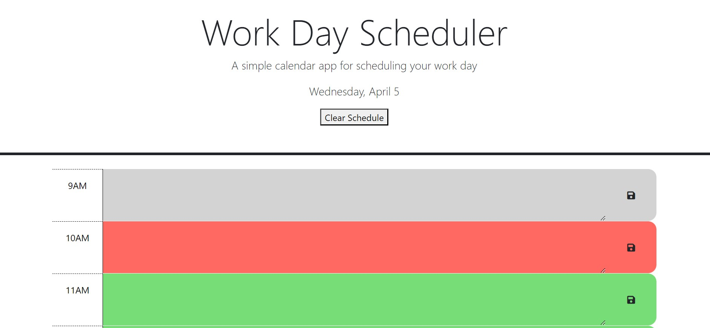

Repository for Daily work scheduler.

A daily work scheduler that shows the past, present, and future hour as grey, red and green. User can input text into each hour window and save it to local storage by clicking the save icon at the right end of each hour window. Date is displayed at the top of the page.

https://lailiel.github.io/05-Work-Day-Scheduler/

